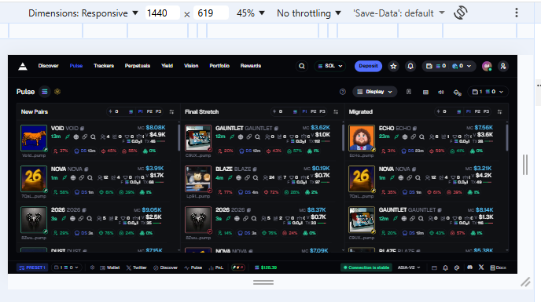
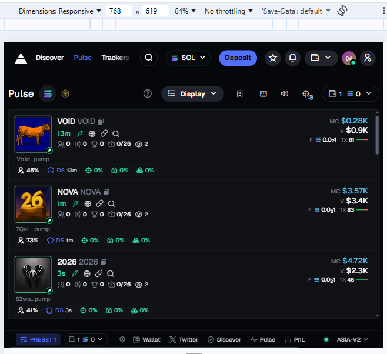
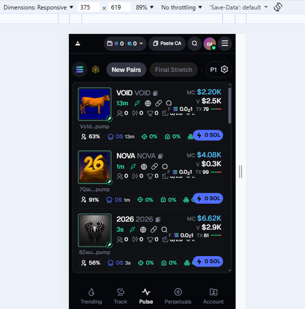
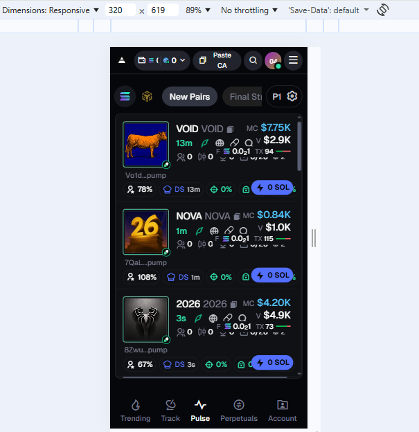

## Axiom SOL | Pulse — Token Trading Table

## Overview
A high-performance, real-time crypto token trading table inspired by modern Solana trading terminals.
Built with Next.js, TypeScript, Tailwind CSS, and WebSockets, focusing on speed, responsiveness, and correctness.

## Live Links
- Vercel Deployment: https://axiom-trade-pulse-mahesh.vercel.app/
- GitHub Repository: https://github.com/MaheshN1821/axiom-trade-pulse/
- Demo Video: https://www.youtube.com/watch?v=Kv9gCkt6140

## Features
- Real-time token updates using WebSocket server
- REST API for initial data hydration
- Three independent token columns (New Pairs, Final Stretch, Migrated)
- Skeleton loaders for smooth loading experience
- Responsive layout down to 320px width
- Optimized rendering for large token lists
- Dark-mode optimized UI

# Tech Stack

## Frontend
- Next.js (App Router)
- TypeScript
- React
- Tailwind CSS
- React Query

## Backend
- Node.js
- REST API
- WebSocket (ws)

## Data Flow

1. REST API (Initial Load)
- Frontend fetches token data from /api/tokens
- Provides immediate data for first render
- Skeleton UI shown during fetch

2. WebSocket (Live Updates)
- Frontend establishes a WebSocket connection
- Server emits periodic token updates
- UI updates incrementally without full re-render

This hybrid approach mirrors real trading platforms:
REST for fast initial load
WebSockets for low-latency live updates

## Responsive Design

### Desktop (1440px)

### Tablet (768px)

### Mobile - Large (375px)

### Mobile - Small (320px)

